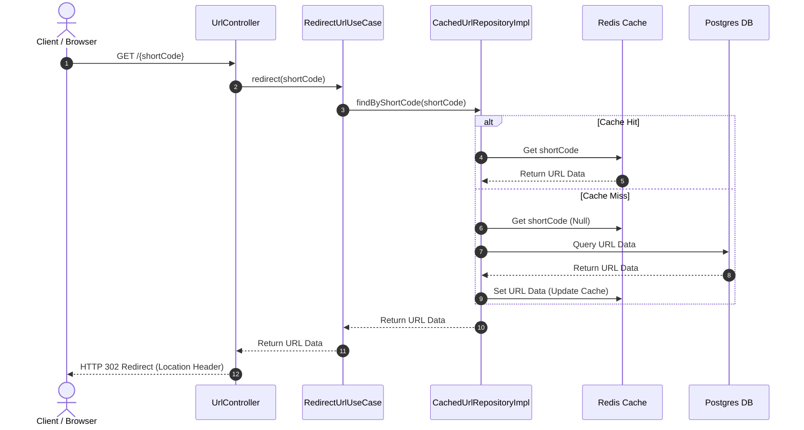
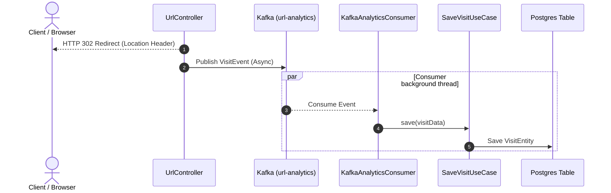

# How is the URL shortener structured?

This page describes the structural architecture of the high-throughput URL shortener, explaining how hexagonal layers organize dependencies and how data flows across cache and messaging components.

## Core architectural pattern

The application structures dependencies using Hexagonal Architecture, decoupling core business logic from databases, caches, and transport protocols. Inside the package structure, classes reference outward adapters only through interfaces called ports, which ensures clean testability and modularity.

The application organizes source files into four architectural layers:

- **domain**: Defines the core business models, input ports (use cases), and output ports (repository interfaces). This layer depends on zero external libraries or Spring Framework annotations.
- **application**: Manages incoming traffic through controllers and validates data transfer objects (DTOs) for Web requests.
- **infrastructure**: Implements outbound ports using Spring Data JPA, Redis caches, Kafka producers, and MapStruct mappers.
- **shared**: Holds global configurations, exception handler strategies, and uniform response structures.

## Database schema design

The persistence layer uses PostgreSQL to store redirect data and click analytics. Flyway manages migrations to construct and modify the relational database schema.

The relational design comprises two main tables:

- **urls**: Stores the short code mapping, target URL, and expiration timestamps.
- **visits**: Records analytics events for redirect requests.

```sql
CREATE TABLE urls (
    id BIGSERIAL PRIMARY KEY,
    original_url VARCHAR(2048) NOT NULL,
    short_code VARCHAR(50) NOT NULL UNIQUE,
    created_at TIMESTAMP NOT NULL,
    updated_at TIMESTAMP NOT NULL,
    original_url_hash CHAR(32) GENERATED ALWAYS AS (md5(original_url)) STORED,
    expires_at TIMESTAMP NULL
);

CREATE INDEX idx_urls_short_code ON urls(short_code);
CREATE INDEX idx_urls_original_url_hash ON urls(original_url_hash);

CREATE TABLE visits (
    id BIGSERIAL PRIMARY KEY,
    short_code VARCHAR(50) NOT NULL,
    ip_address VARCHAR(45),
    user_agent VARCHAR(512),
    clicked_at TIMESTAMP NOT NULL
);

CREATE INDEX idx_visits_short_code ON visits(short_code);
```

To optimize read performance on write commands, the `urls` table generates an MD5 hash of the target URL. The application uses this indexed hash columns to deduplicate URLs without querying a full text column.

## Short Code Generation Logic

The system generates 6-character short codes using a cryptographically secure random generator:

- **Algorithm**: Selecting 6 random characters from the Base62 alphabet (`[a-zA-Z0-9]`) using `java.security.SecureRandom`.
- **Collision Handling**: If a generated code already exists in the database (verified via the indexed `short_code` column), the application recursively generates a new code.
- **Custom Aliases**: Users can supply a custom code (e.g., `/my-alias`). If the custom code is already taken, a `ShortCodeAlreadyExistsException` is thrown.
- **Deduplication**: To save space, if a request does not specify a custom code, the system checks if the original URL has already been shortened (using the indexed MD5 hash of the original URL). If found and not expired, the existing short code is returned.

## Request flow paths

Data flows through different architectural profiles depending on the active configuration.

### Redirect request path

```
[Client] ---> [UrlController]
                     |
                     v
           [RedirectUrlUseCase]
                     |
                     v
          [CachedUrlRepositoryImpl]
           /                     \
     (Cache Hit)             (Cache Miss)
         /                         \
        v                           v
 [RedisUrlCacheService]      [PostgresUrlRepositoryImpl]
                                    |
                                    v
                              (Update Cache)
                                    |
                                    v
                         [RedisUrlCacheService]
```



### Analytics ingestion flow

The application records analytics asynchronously in the high-performance profile to protect redirect latency:

```
[Client] ---> [UrlController] ---> (HTTP 302 Redirect Location)
                     |
              (Async Event)
                     |
                     v
           [KafkaAnalyticsAdapter]
                     |
             (Publish Payload)
                     |
                     v
             [Kafka Topic]
                     |
             (Consume Event)
                     |
                     v
         [KafkaAnalyticsConsumer]
                     |
                     v
            [SaveVisitUseCase]
                     |
                     v
      [PostgresVisitDatabaseAdapter]
                     |
                     v
             [Postgres Table]
```


