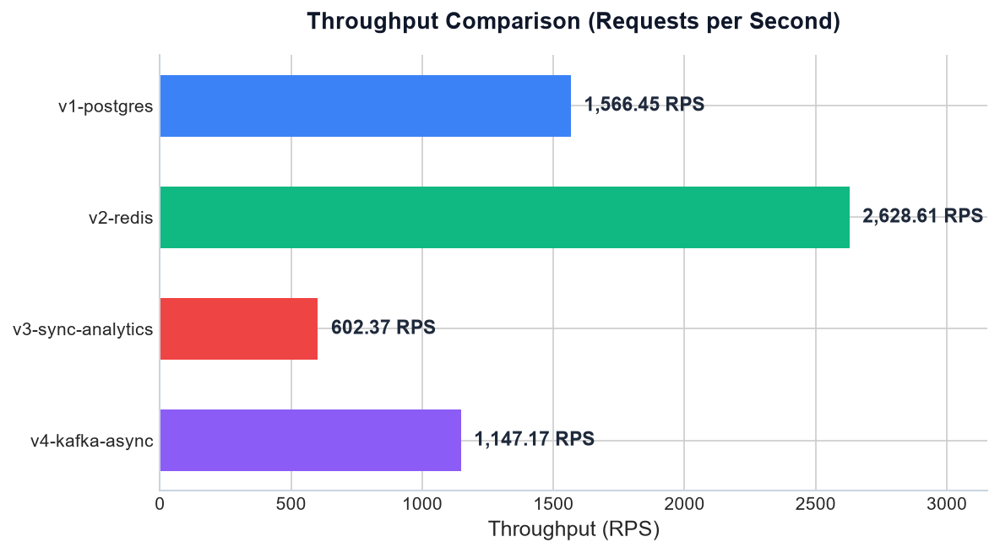
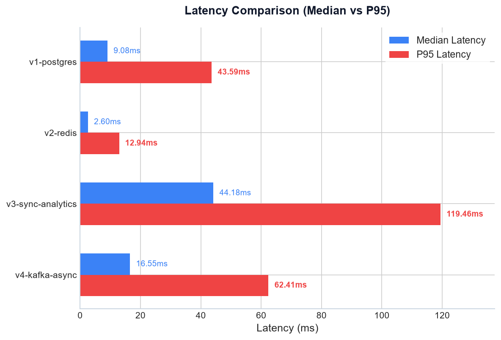
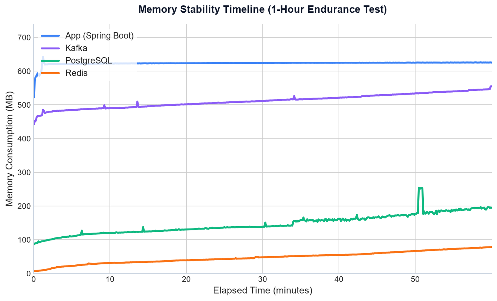

# How do database caching and message queues impact redirect performance?

This page presents the load testing methodology, parameters, and performance results across four architectural revisions of the URL shortener.

## Testing environment

All benchmarks run under isolated Docker containers to prevent queue sharing or TCP socket reuse. The test host runs WSL2 on an AMD64 architecture with 4 vCPUs and 8 GB of allocated memory.

The test suite exercises the system using three test scenarios:

- **Baseline Comparison**: 50 Virtual Users (VUs) running a GET-only workload for 30s after a 10s warm-up. This measures clean redirect speed.
- **Load Test**: 500 VUs running a mixed workload (90% GET redirects, 10% POST writes) for 10m on the Kafka asynchronous profile (`v4-kafka-async`).
- **Endurance Test**: 200 VUs running a mixed workload (90% GET redirects, 10% POST writes) for 1h on the Kafka asynchronous profile (`v4-kafka-async`) to monitor CPU and memory stability.

## Baseline comparison results

The baseline comparison measures throughput and latency across all four profiles under a GET-only redirect workload.

| Version | Profile | Throughput | Median Latency | P95 Latency | Error Rate |
|---|---|---:|---:|---:|---:|
| **`v1-postgres`** | `v1` | 1566.45 RPS | 9.08 ms | 43.59 ms | 0.00% |
| **`v2-redis`** | `v2` | 2628.61 RPS | 2.60 ms | 12.94 ms | 0.00% |
| **`v3-sync-analytics`** | `v3` | 602.37 RPS | 44.18 ms | 119.46 ms | 0.00% |
| **`v4-kafka-async`** | `v4` | 1147.17 RPS | 16.55 ms | 62.41 ms | 0.00% |

### Throughput comparison (RPS)

The following chart illustrates the throughput comparison in Requests per Second (RPS) across versions:

### Latency comparison (Median vs P95)

The following chart illustrates the median (blue) and P95 (red) latency across versions:

### Technical insights

- **Caching acceleration**: Introducing the Redis read-through cache in `v2-redis` boosts throughput by 67% over the database baseline. This cuts P95 latency by 70%, as Redis serves hot redirects without hitting the PostgreSQL disk queues.
- **Synchronous analytics write bottleneck**: Recording visit entries synchronously in `v3-sync-analytics` degrades performance. Throughput drops by 77% compared to `v2-redis`, and P95 latency jumps to 119.46 ms because the system blocks HTTP worker threads until PostgreSQL completes the transaction write.
- **Asynchronous messaging decoupling**: Decoupling writes using Kafka in `v4-kafka-async` restores performance. Throughput increases by 90% over the synchronous baseline, and P95 latency falls back to 62.41 ms. The API publishes event payloads to the topic and returns the HTTP 302 immediately, offloading the database commit work to a consumer thread.

## Load test results (v4-kafka-async)

The Load Test pushes the Kafka asynchronous profile to 500 VUs running a mixed workload for 10m.

- **Total Requests**: 1,259,954
- **Throughput**: 2,095.84 RPS
- **Error Rate**: 0.00% (100% of checks passed)
  - `POST status is 201` checks passed: 125,605
  - `GET status is 302` checks passed: 1,134,249
- **Median Latency**: 211.21 ms
- **P95 Latency**: 397.38 ms

Under heavy load, Tomcat worker queues and connection pools remain stable, delivering zero request failures across more than one million operations.

## Endurance test results (v4-kafka-async)

The Endurance Test runs the Kafka asynchronous profile under a stable load of 200 VUs for 1h to monitor system resource consumption.

- **Total Requests**: 2,475,167
- **Throughput**: 687.5 RPS
- **Error Rate**: 0.00% (100% of checks passed)

### Resource stability analysis

Container resources stabilize within the first 3m and maintain a flat line profile for the remaining duration:

- **Application container (Spring Boot)**: Memory scales from 522.0 MB up to a flat 625.5 MB. CPU usage hovers between 45% and 55% once JIT compilation completes.
- **Database container (PostgreSQL)**: Memory holds steady at 195.1 MB. CPU usage scales with connection pool activity, peaking around 280% on multi-core allocations during write peaks.
- **Cache container (Redis)**: Memory utilization settles at 78.39 MB, matching the TTL cache expiry limits. CPU remains under 5%.
- **Message queue container (Kafka)**: Memory footprint stays flat at 555.0 MB, while CPU usage averages 5%.

The flat memory metrics confirm the absence of memory leaks in the Java application and connection adapters.

### Resource utilization timeline (1h Endurance Test)

The following chart plots the memory consumption in Megabytes (MB) across containers during the one-hour test:

